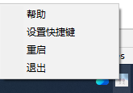

# shouyu
Quickly record the clipboard to MS/WPS Excel file by using shortcut keys quickly. Suitable for users whose record habits and currently only support Windows users.
Please refer to kb.ini to set/change excel path and shortcuts.

# Cases
- When users are studying a complex problem, they often need to take notes quickly without being disturbed, but all note-taking tools on the market need to switch to another interface to paste and copy, which causes the user's thinking to be interrupted. shouyu provides a shortcut to save, using the bubble pop-up box does not disturb the user's thinking.
- New tab records are generated every day in a tree hierarchy to make the timeline clear and easy to retrieve.

# Features
- 
- 
- 
