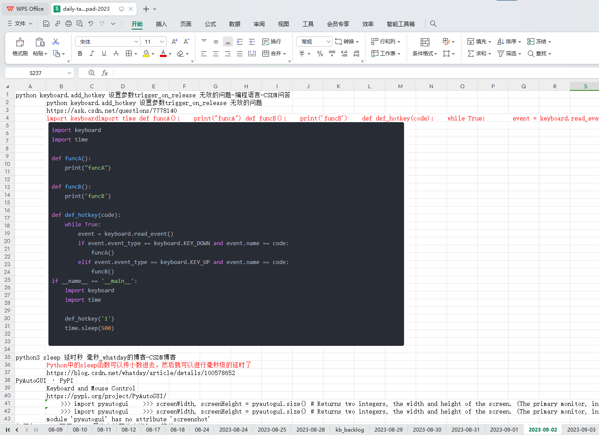
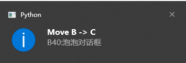
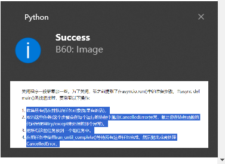
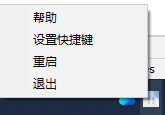

# 设计思路

shouyu 是一个「随手记」工具：通过快捷键把剪贴板里的文本、图片快速记录到 Excel，作为个人知识库；同时内置每日任务 / 习惯 / 番茄钟，帮你规划并专注完成一天中最重要的事。目前仅支持 Windows。

**要解决的痛点：**
- 学习或思考复杂问题时，常常需要一边看资料一边快速记笔记，但市面上的笔记工具大多要切换到另一个界面才能粘贴保存，思路很容易被打断。
- 之前记录的内容过一段时间再回看时，往往缺少上下文、看不懂，效率很低。

**设计理念：**
- 只用键盘、不碰鼠标：通过全局快捷键把重要的文字、图片直接记进 Excel 知识库，用气泡提示保存、不打断当前工作。
- 用 Excel 做存储与展示：每天自动新建一个 tab（工作表），天然形成按时间线的层级结构；用 Excel 打开一看就懂，还能在手机、平板等各种平台上查看，不需要额外学习成本。
- 全局快捷键（可在 [kb.ini](kb.ini) 中查看 / 修改）：
    - `ctrl+shift+enter`：保存剪贴板内容到 Excel（按 1 次存到 B 列，快速按 2 次存到 A 列）
    - `ctrl+\`：用 Excel / WPS 打开知识库
    - `ctrl+q`：关闭 Excel
    - `alt+/`：查看上一条保存的记录并定位
    - `ctrl+alt+\``：打开今日任务面板
    - `ctrl+alt+h`：重新打开晨间仪式（习惯 + 规划）对话框
    - `ctrl+alt+p`：开始 / 暂停番茄钟（窗口被隐藏时则唤回窗口）
    - `ctrl+alt+t`：显示 / 隐藏悬浮番茄窗口
    - `ctrl+alt+r`：从自动备份中恢复（主 Excel 损坏或误改时可回滚）

**TODO：**
- 结合向量数据库做模糊语义检索，实现快速查找与定位。
- 后续考虑训练本地 LLM，避免敏感 / 公司信息泄漏。
- 通过录屏或 OCR，避免遗漏无意识中产生的重要信息。

# shouyu
Quickly record the content (text & image) of clipboard to MS/WPS Excel file by using hot keys. Suitable for users whose record habits and currently only support Windows users.

# Cases
- When users are studying a complex problem, they often need to take notes quickly without being disturbed, but all note-taking tools on the market need to switch to another interface to paste and copy, which causes the user's thinking to be interrupted. shouyu provides a shortcut to save, using the bubble pop-up box does not disturb the user's thinking.
- New tab records are generated every day in a tree hierarchy to make the timeline clear and easy to retrieve.

# Features
- Please refer to [kb.ini](kb.ini) to set/change excel path and shortcuts.
- 
- 
- 
- 

# 更新日志 (Changelog)

> 约定：每次改动都在本节最上方按日期追加条目（最新在前）。每条注明「做了什么 + 涉及文件」。

## 2026-07-26

- **番茄钟「去休息」提前结束**：专注阶段新增「去休息」按钮，任务提前做完时可立即结束当前番茄并进入休息（按番茄数决定短休/长休）。提前结束仍计一个 🍅，并按**实际专注时长**记录到 Excel；晨间规划阶段点它则进入规划休息、不计 🍅。（`shouyu/service/pomodoro.py`、`shouyu/view/pomodoro_window.py`）
- **番茄钟休息提醒卡片**：休息开始时在屏幕居中弹出醒目大卡片（大号倒计时 + 开始休息 / 延长 / 跳过 按钮），避免埋头工作错过休息。可通过 `kb.ini` 的 `break_reminder` 开关控制。（`shouyu/view/pomodoro_window.py`、`shouyu/config.py`）
- **番茄钟锁屏静音**：Windows 下通过 `OpenInputDesktop` 检测锁屏；锁屏期间静音提示音并跳过「走神」告警升级，避免锁屏后仍被打扰。可通过 `kb.ini` 的 `silence_when_locked` 开关控制。（`shouyu/util/idle.py`、`shouyu/service/pomodoro.py`）
- **Backlog（待办池）功能**：习惯对话框改为三栏布局——「今日习惯 / 今日要事 / Backlog」。Backlog 分「工作」「生活」两个区，分别持久化到 `backlog-work`、`backlog-life` 两张 sheet；支持三个列表之间拖拽移动与列表内排序，含完整撤销/重做；Backlog 条目显示「已搁置 N 天」。（`shouyu/service/plan.py`、`shouyu/service/excel.py`、`shouyu/view/habit_dialog.py`）
- **手动「清理未完成 → Backlog」按钮**：放在「今日要事」面板，一键把未完成任务扫进 Backlog（去重、可撤销）；取消了关闭窗口时自动弹窗的打扰。（`shouyu/view/habit_dialog.py`）
