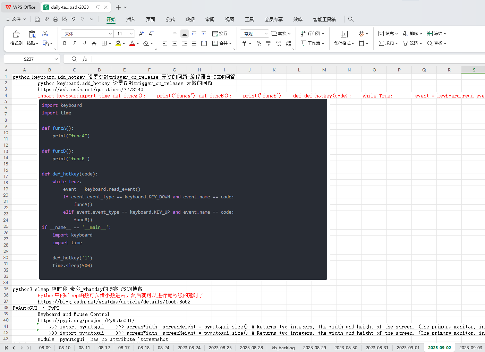
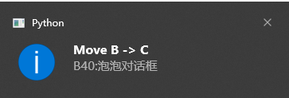
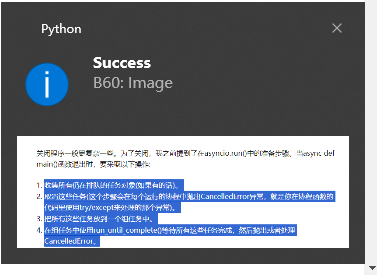
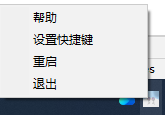

# 设计思路

shouyu 是一个「随手记」工具：通过快捷键把剪贴板里的文本、图片快速记录到 Excel，作为个人知识库；同时内置每日任务 / 习惯 / 番茄钟，帮你规划并专注完成一天中最重要的事。目前仅支持 Windows。

**要解决的痛点：**
- 学习或思考复杂问题时，常常需要一边看资料一边快速记笔记，但市面上的笔记工具大多要切换到另一个界面才能粘贴保存，思路很容易被打断。
- 之前记录的内容过一段时间再回看时，往往缺少上下文、看不懂，效率很低。

**设计理念：**
- 只用键盘、不碰鼠标：通过全局快捷键把重要的文字、图片直接记进 Excel 知识库，用气泡提示保存、不打断当前工作。
- 用 Excel 做存储与展示：每天自动新建一个 tab（工作表），天然形成按时间线的层级结构；用 Excel 打开一看就懂，还能在手机、平板等各种平台上查看，不需要额外学习成本。
- 全局快捷键（可在 [kb.ini](kb.ini) 中查看 / 修改）：
    - `ctrl+shift+enter`：保存剪贴板内容到 Excel（按 1 次存到 B 列，快速按 2 次存到 A 列）
    - `ctrl+\`：用 Excel / WPS 打开知识库
    - `ctrl+q`：关闭 Excel
    - `alt+/`：查看上一条保存的记录并定位
    - `ctrl+alt+\``：打开今日任务面板
    - `ctrl+alt+h`：重新打开晨间仪式（习惯 + 规划）对话框
    - `ctrl+alt+p`：开始 / 暂停番茄钟（窗口被隐藏时则唤回窗口）
    - `ctrl+alt+t`：显示 / 隐藏悬浮番茄窗口
    - `ctrl+alt+r`：从自动备份中恢复（主 Excel 损坏或误改时可回滚）

**TODO：**
- 结合向量数据库做模糊语义检索，实现快速查找与定位。
- 后续考虑训练本地 LLM，避免敏感 / 公司信息泄漏。
- 通过录屏或 OCR，避免遗漏无意识中产生的重要信息。

# shouyu
Quickly record the content (text & image) of clipboard to MS/WPS Excel file by using hot keys. Suitable for users whose record habits and currently only support Windows users.

# Cases
- When users are studying a complex problem, they often need to take notes quickly without being disturbed, but all note-taking tools on the market need to switch to another interface to paste and copy, which causes the user's thinking to be interrupted. shouyu provides a shortcut to save, using the bubble pop-up box does not disturb the user's thinking.
- New tab records are generated every day in a tree hierarchy to make the timeline clear and easy to retrieve.

# Features
- Please refer to [kb.ini](kb.ini) to set/change excel path and shortcuts.
- 
- 
- 
- 

# 更新日志 (Changelog)

> 约定：每次改动都在本节最上方按日期追加条目（最新在前）。每条注明「做了什么 + 涉及文件」。

## 2026-09-30

- **支持控制台 Ctrl+C 正常退出**：开发模式和打包模式的 watchdog 都会把 Ctrl+C 识别为用户主动退出，先停止子进程并清理退出标记，不再误判为崩溃后自动重启。（`main.py`、`shouyu/util/supervisor.py`）
- **忽略运行时文件**：将 `kb.log`、`crash.log` 和 `shouyu_state.json` 纳入 `.gitignore`，避免本地日志、崩溃诊断和运行状态进入版本控制。（`.gitignore`）
- **集中配置运行日志路径**：新增 `log_path` 和 `crash_log_path`，配置绝对路径后开发版与 dist 版统一写入指定的 `kb.log` / `crash.log`，不再使用 dist 目录下的日志；未配置时继续回退到程序目录。（`kb.ini`、`shouyu/config.py`、`shouyu/log.py`、`shouyu/util/crash.py`、`shouyu/util/supervisor.py`、`shouyu/view/tray.py`）
- **增强崩溃诊断与自动恢复**：将 Qt 应用和窗口移回主线程，降低 Windows 下 Qt 对话框导致的进程级崩溃；增加父进程 watchdog，异常退出后自动重启并恢复已有番茄/任务状态；异常恢复时界面提示用户，并在 `kb.log`、`crash.log` 中记录 Python 与原生崩溃信息；圆球右键菜单新增错误日志入口；修复 Ctrl+Enter 保存后重复触发 closeEvent 导致同一任务重复入队的问题。（`main.py`、`shouyu/view/qt_app.py`、`shouyu/util/crash.py`、`shouyu/util/supervisor.py`、`shouyu/util/process.py`、`shouyu/view/tray.py`、`shouyu/view/pomodoro_window.py`、`shouyu/view/habit_dialog.py`）
- **完成任务后的反思改为非阻塞提示**：默认不再弹出模态总结对话框，完成任务后显示可自动消失的提示，可点击「记录反思」再编辑；右键菜单继续保留反思入口，并通过 `reflection_prompt=off/toast/dialog` 支持关闭、非阻塞提示和旧弹窗三种模式。（`kb.ini`、`shouyu/config.py`、`shouyu/view/habit_dialog.py`）
- **统一 SQLite 数据库位置**：新增 `sqlite_db_path` 配置；配置绝对路径时开发版和打包版共用指定的 `shouyu.db`，未配置时继续使用程序目录下的默认数据库；附件目录同步跟随数据库位置。（`kb.ini`、`shouyu/config.py`、`shouyu/service/message_queue.py`）
- **新增任务「挂起」状态**：使用黄色琥珀色标识，贯穿 Excel 读写、任务列表展示、右键状态菜单、统计和未完成任务结转；挂起任务区别于普通待办，表示曾经开始但被更高优先级事项打断。（`shouyu/service/plan.py`、`shouyu/view/styles.py`、`shouyu/view/habit_dialog.py`）
- **增加任务窗口最大化/还原控制**：右上角新增窗口状态按钮，最大化时占满可用屏幕，点击还原回到适合编辑的窗口大小，再次点击可恢复最大化。（`shouyu/view/habit_dialog.py`）
- **支持历史日期未完成任务选择**：自动查找最近 30 天内最近一个有任务的日期，并提供 1/2/3 天前、最近有任务和自选日期入口；选中后可直接查看、结转或标记该日期的未完成任务，周末无任务时也能继续使用。（`shouyu/view/habit_dialog.py`、`shouyu/service/excel.py`）
- **修复新增任务覆盖 other 区域**：计划列表扩展前自动为 `other` 区域插入空行，并同步移动其中的图片锚点，新增大量任务不会再覆盖剪贴板内容或导致任务读取错乱。（`shouyu/service/plan.py`）

## 2026-09-27

- **恢复重启前的番茄与规划状态**：持久化当前阶段、结束时间、暂停剩余时间、任务和已完成番茄数；重启或主进程崩溃后优先恢复当天未结束的会话，不再重新开启规划或工作计时；状态文件采用原子替换，降低异常退出导致文件损坏的风险。（`main.py`、`shouyu/service/pomodoro.py`、`shouyu/util/state.py`）
- **完善圆球右键菜单与展开收起交互**：圆球右键菜单加入原卡片操作、托盘菜单中的帮助/设置/任务/备份/队列/开机启动/重启/退出等功能；新增隐藏入口并复用原有显示/隐藏快捷键；展开卡片新增「收起圆球」按钮，双击和 Esc 仍可切换。（`shouyu/view/pomodoro_window.py`）
- **增强走神提醒**：走神时增加红色脉冲光晕、黄色闪烁外圈和右上角感叹号标记，让小尺寸圆球在桌面上更容易被注意到。（`shouyu/view/pomodoro_window.py`）

## 2026-09-24

- **修复圆球外仍有半透明方框**：关闭 Windows 11 窗口圆角/边框的设置改到窗口每次显示后执行（显示前设置会被系统忽略），圆球外部现在完全透明。（`shouyu/view/pomodoro_window.py`）
- **圆球去边框 + 晶莹立体质感**：关闭 Windows 11 给顶层窗口自动加的圆角和 1px 边框（圆球外面不再有方框）；圆球改为玻璃质感绘制：径向渐变球体、顶部高光、底部折射光、小亮点、玻璃描边和柔和投影，配色调得更通透；走神告警改为黄色光晕闪烁。（`shouyu/view/pomodoro_window.py`）
- **番茄钟浮窗改为可拖动小圆球**：浮窗默认缩成 76px 圆球，中间显示倒计时和阶段名；专注/计划为红色，休息/午休为绿色，空闲/暂停为灰色，走神告警时圆球外圈黄色闪烁。双击圆球展开为原来的完整卡片，按 Esc 缩回圆球；展开/收起时朝屏幕中心方向伸缩，避免超出屏幕。触发强告警时自动展开以显示「我回来了」按钮，确认后自动缩回。（`shouyu/view/pomodoro_window.py`）

## 2026-07-26

- **修复 Win10/11 锁屏检测失效（锁屏后仍每几秒嘟嘟）**：原先用 `OpenInputDesktop` 返回 NULL 判断锁屏，在现代 Windows 上并不可靠（锁屏后常仍能打开输入桌面→误判未锁）。改为以 `WTSQuerySessionInformationW` + `WTSSessionInfoEx` 的 `SessionFlags` 为主检测（Win8+ 判断锁屏的标准方式，兼容 Win7 的标志位反转），`OpenInputDesktop` 降级为兜底。（`shouyu/util/idle.py`）
- **番茄进行中切换任务不再重开计时**：专注中再点另一条任务的「专注」，只把当前番茄「换名」继续（保留剩余时间与起始点），不再从满时长重开；同时完成 / 切换「进行中」任务时，番茄窗口的「→ 任务名」会实时同步（无进行中任务则清空），消除陈旧显示。新增服务方法 `set_current_task` 与 `task_changed` 事件。（`shouyu/service/pomodoro.py`、`shouyu/view/pomodoro_window.py`、`shouyu/view/habit_dialog.py`）
- **番茄钟「去休息」提前结束**：专注阶段新增「去休息」按钮，任务提前做完时可立即结束当前番茄并进入休息（按番茄数决定短休/长休）。提前结束仍计一个 🍅，并按**实际专注时长**记录到 Excel；晨间规划阶段点它则进入规划休息、不计 🍅。（`shouyu/service/pomodoro.py`、`shouyu/view/pomodoro_window.py`）
- **番茄钟休息提醒卡片**：休息开始时在屏幕居中弹出醒目大卡片（大号倒计时 + 开始休息 / 延长 / 跳过 按钮），避免埋头工作错过休息。可通过 `kb.ini` 的 `break_reminder` 开关控制。（`shouyu/view/pomodoro_window.py`、`shouyu/config.py`）
- **番茄钟锁屏静音**：Windows 下通过 `OpenInputDesktop` 检测锁屏；锁屏期间静音提示音并跳过「走神」告警升级，避免锁屏后仍被打扰。可通过 `kb.ini` 的 `silence_when_locked` 开关控制。（`shouyu/util/idle.py`、`shouyu/service/pomodoro.py`）
- **Backlog（待办池）功能**：习惯对话框改为三栏布局——「今日习惯 / 今日要事 / Backlog」。Backlog 分「工作」「生活」两个区，分别持久化到 `backlog-work`、`backlog-life` 两张 sheet；支持三个列表之间拖拽移动与列表内排序，含完整撤销/重做；Backlog 条目显示「已搁置 N 天」。（`shouyu/service/plan.py`、`shouyu/service/excel.py`、`shouyu/view/habit_dialog.py`）
- **手动「清理未完成 → Backlog」按钮**：放在「今日要事」面板，一键把未完成任务扫进 Backlog（去重、可撤销）；取消了关闭窗口时自动弹窗的打扰。（`shouyu/view/habit_dialog.py`）
