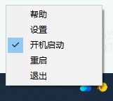

市面上的笔记软件偏重于整理归纳这个过程，但需要的材料从哪里来？“授渔”要做事情就是解决快速收集素材的问题。

 **痛点：** 
- 日常工作生活中会与不同的桌面程序打交道，信息是分散的！
- 当我们需要他们的时候去淹没在信息的海洋里，很难找到！

 **解决方案：** 
- excel作为存储和展示：tab（按天管理搜集的素材）；表格提供了层级结构；支持手机、平板跨平台共享，天然的（一个人开发，我就不需要再做轮子）。
    - ctrl+\：打开excel
    - ctrl+q: 关闭excel
- 全局的快捷键帮助我们快速查看、截取文字和图片
    - ctrl+C两次: 保存剪切板的信息
    - ctrl+shift+enter: 一键保存所选中文字+截屏+标题+链接（chrome）
    - PrintScreen/alt+PrintScreen两次：保存图片
    - ctrl+enter: 如果信息已经放在剪切板，保存到剪切板
    - alt+/: 查看最近一次保存的信息
    - alt+left/right: 跳转层级
    - alt+up/down: 往上下一行（增量式添加）
- 气泡提醒保存进度，不打断用户思考。
- TODO: 任务和素材结合，层级显示。

# shouyu
Quickly record the content (text & image) of clipboard to MS/WPS Excel file by using hot keys. Suitable for users whose record habits and currently only support Windows users.

# Cases
- When users are studying a complex problem, they often need to take notes quickly without being disturbed, but all note-taking tools on the market need to switch to another interface to paste and copy, which causes the user's thinking to be interrupted. shouyu provides a shortcut to save, using the bubble pop-up box does not disturb the user's thinking.
- New tab records are generated every day in a tree hierarchy to make the timeline clear and easy to retrieve.

# Features
- Please refer to [kb.ini](kb.ini) to set/change excel path and shortcuts.
- 
- 
- 
- 
